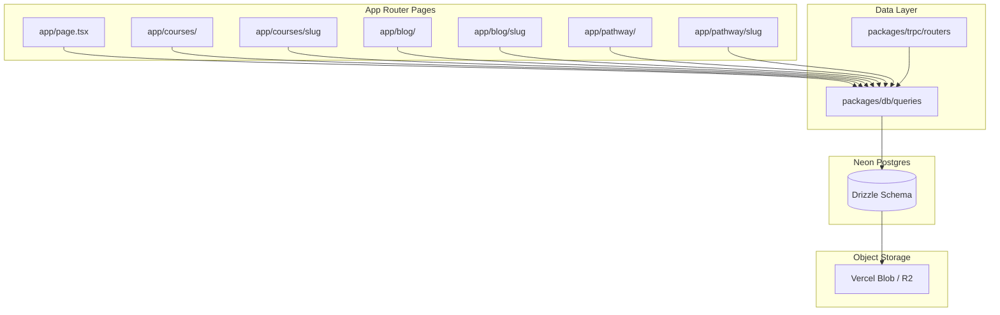

# Mock DB to Neon Migration Plan

## Current State

- **Mock data**: [mock-db/](mock-db/) holds `courses`, `pathways`, `blogPosts`, `faqs`, `features`, `testimonials`, `instructors` with nested structures (Course→modules→sections→lessons, BlogPost→author, Pathway→courseIds).
- **Consumers**: [app/page.tsx](app/page.tsx), [app/courses/](app/courses/), [app/blog/](app/blog/), [app/pathway/](app/pathway/) import directly from `@/mock-db`. [TestimonialCardDemo](components/demo/testimonial-card-demo.tsx) uses hardcoded testimonials (not mock-db).
- **Existing DB**: Drizzle + Neon in [packages/db/](packages/db/), with `auth` and `profile` schemas. tRPC + TanStack Query already wired in [packages/trpc/](packages/trpc/).

---

## Phase 1: Schema Design and Creation

### 1.1 Schema Analysis

Extend existing Drizzle schemas in [packages/db/schema/](packages/db/schema/). Key decisions:


| Entity         | Tables                                                                        | Notes                                                                                                                                                                    |
| -------------- | ----------------------------------------------------------------------------- | ------------------------------------------------------------------------------------------------------------------------------------------------------------------------ |
| **Instructor** | `instructor`                                                                  | id, **user_id** (FK to `user`, unique, nullable for seed), name, bio, photo_url, credentials (jsonb), experience. Links instructor to Better Auth for instructor portal. |
| **Course**     | `course`, `course_module`, `course_section`, `course_lesson`, `course_review` | Normalize modules/sections/lessons; reviews reference `user.id` (Better Auth)                                                                                            |
| **Pathway**    | `pathway`, `pathway_course`                                                   | Many-to-many via junction; `course_order` for sequence                                                                                                                   |
| **Blog**       | `author`, `blog_post`                                                         | Author separate; `blog_post.author_id` FK                                                                                                                                |
| **Static**     | `faq`, `feature`, `testimonial`                                               | Flat tables; testimonials optional `course_id`, `pathway_id`                                                                                                             |


**Array/JSON columns**: Use `jsonb` for arrays (`credentials`, `tags`, `whatYoullLearn`, etc.) for flexibility and indexing.

**Image fields**: Store URLs as `text` (e.g. `photo_url`, `thumbnail_url`, `featured_image_url`, `video_url`). Actual file storage handled separately (Phase 3).

### 1.1.1 Instructor Portal: Auth Linkage

To support an **instructor portal** where users sign in as instructors:

- Add `user_id` (nullable, unique) to `instructor`, FK to `user.id`.
- **Auth flow**: If a user has an `instructor` row with `user_id = session.user.id`, they can access the instructor portal.
- **Role model**: No separate `role` column required—presence of an instructor record implies instructor access.
- **Seed data**: Seed instructors can have `user_id = null` (display-only, e.g. Dr. James Wilson). Real instructors created later get `user_id` when they sign up or are promoted.
- **Future**: Instructor portal pages (e.g. `/instructor/dashboard`, `/instructor/courses`) check `getInstructorByUserId(session.user.id)` and redirect/403 if not found.

### 1.2 Create Schema Files

- [packages/db/schema/instructor.ts](packages/db/schema/instructor.ts) - instructor table with `user_id` FK to `user` (nullable for seed)
- [packages/db/schema/course.ts](packages/db/schema/course.ts) - course, course_module, course_section, course_lesson, course_review
- [packages/db/schema/pathway.ts](packages/db/schema/pathway.ts) - pathway, pathway_course
- [packages/db/schema/blog.ts](packages/db/schema/blog.ts) - author, blog_post
- [packages/db/schema/faq.ts](packages/db/schema/faq.ts) - faq
- [packages/db/schema/feature.ts](packages/db/schema/feature.ts) - feature
- [packages/db/schema/testimonial.ts](packages/db/schema/testimonial.ts) - testimonial

Update [packages/db/index.ts](packages/db/index.ts) to export all schemas and ensure `drizzle.config.ts` picks them up.

### 1.3 Generate and Apply Migrations

```bash
bun run db:generate
bun run db:migrate
```

---

## Phase 2: Seed Mock Data into DB

### 2.1 Create Seed Script

- Add [packages/db/seed.ts](packages/db/seed.ts) (or `scripts/seed-db.ts`) that:
  1. Inserts instructors
  2. Inserts courses with modules, sections, lessons, reviews (preserve IDs for pathway references)
  3. Inserts pathways and pathway_course rows
  4. Inserts authors and blog posts
  5. Inserts faqs, features, testimonials
- Add `db:seed` script to [package.json](package.json).

### 2.2 Handle Missing Data

- `course_review.userId` / `userName`: Mock uses placeholder `u1`. Either:
  - Create a seed user for reviews, or
  - Make `userId` nullable and keep `userName` for display-only legacy reviews.
- Images: Keep current paths (e.g. `/images/...`) in seed; migration to real storage is Phase 3.

---

## Phase 3: Image Storage Suggestion

Neon does not provide object storage. Recommended pattern (from [Neon file storage docs](https://neon.tech/docs/guides/file-storage)):

**Store file URLs in Postgres; files in external object storage.**

Options:

1. **Vercel Blob** – Simple, native for Vercel deployments. Good for thumbnails, avatars, featured images.
2. **Cloudflare R2** – S3-compatible, egress-free, documented in [Neon + R2 guide](https://neon.tech/docs/guides/cloudflare-r2).
3. **AWS S3** – Standard choice, [Neon guide for Next.js + S3](https://neon.com/guides/next-upload-aws-s3).

**Recommendation**: Start with **Vercel Blob** if deploying on Vercel (minimal setup). Use R2 or S3 if you need a portable, cloud-agnostic setup.

**Implementation**: Create a `packages/storage/` (or `lib/storage.ts`) that:

- Uploads files and returns public URL
- Store that URL in the relevant Postgres column

For this migration, keep existing `/images/...` paths; document storage setup for future uploads.

---

## Phase 4: DB Queries in `packages/db`

### 4.1 Query Files

Create under [packages/db/queries/](packages/db/queries/):

- `instructor.ts` – `getInstructorById`, `getAllInstructors`, `getInstructorByUserId` (for instructor portal auth check)
- `course.ts` – `getAllCourses`, `getCourseBySlug`, `getCourseById`, `getFeaturedCourses`, `getCoursesByInstructorId` (for instructor portal)
- `pathway.ts` – `getAllPathways`, `getPathwayBySlug`, `getPathwayWithCourses`
- `blog.ts` – `getAllBlogPosts`, `getBlogPostBySlug`, `getRelatedPosts`
- `faq.ts` – `getAllFaqs`
- `feature.ts` – `getAllFeatures`
- `testimonial.ts` – `getAllTestimonials`, `getTestimonialsForCourse`, `getTestimonialsForPathway`

Use joins/relations to return nested structures (course with modules/sections/lessons, pathway with courses) to match current mock shape.

---

## Phase 5: Replace Mock Imports with DB Queries

### 5.1 Fetch Strategy (Vercel React Best Practices)


| Page                                                                                   | Current                             | Strategy                                                                                                                |
| -------------------------------------------------------------------------------------- | ----------------------------------- | ----------------------------------------------------------------------------------------------------------------------- |
| [app/page.tsx](app/page.tsx)                                                           | Server, mock imports                | RSC: fetch features, faqs, featured courses, testimonials in parallel; wrap data-fetching parts in Suspense if desired  |
| [app/courses/page.tsx](app/courses/page.tsx)                                           | Client, mock imports                | RSC: fetch all courses server-side, pass as props; client keeps filters (search, category, level) and filters in memory |
| [app/courses/[slug]/page.tsx](app/courses/[slug]/page.tsx)                             | Server, mock + generateStaticParams | RSC: fetch course by slug; generateStaticParams fetches slugs from DB                                                   |
| [app/blog/page.tsx](app/blog/page.tsx)                                                 | Server, mock                        | RSC: fetch blog posts                                                                                                   |
| [app/blog/[slug]/page.tsx](app/blog/[slug]/page.tsx)                                   | Server, mock + generateStaticParams | RSC: fetch post by slug; generateStaticParams from DB                                                                   |
| [app/pathway/page.tsx](app/pathway/page.tsx)                                           | Server, mock                        | RSC: fetch pathways with courses                                                                                        |
| [app/pathway/[slug]/page.tsx](app/pathway/[slug]/page.tsx)                             | Server, mock + generateStaticParams | RSC: fetch pathway by slug; generateStaticParams from DB                                                                |
| [components/demo/testimonial-card-demo.tsx](components/demo/testimonial-card-demo.tsx) | Client, hardcoded                   | Use testimonials from DB: either pass as props from RSC parent or use tRPC                                              |


### 5.2 Caching and Deduplication

- **React.cache()** for per-request deduplication of `getCourseBySlug`, `getBlogPostBySlug`, etc.
- **LRU cache** (e.g. `lru-cache`) for rarely changing data (features, faqs) if cross-request caching is desired.
- **Next.js `unstable_cache**` or `revalidate` for static-ish pages (blog, pathways) if needed.

### 5.3 tRPC Usage

- Add tRPC routers for: courses, pathways, blog, faqs, features, testimonials.
- Use tRPC + TanStack Query where:
  - Client needs to refetch (e.g. course list with server-side filters later)
  - Mutations (e.g. enroll, bookmark)
- Prefer direct query calls in RSCs for initial data.

---

## Phase 6: Delete Mock DB

- Remove [mock-db/](mock-db/) directory.
- Update any remaining imports.
- Remove `@/mock-db` from tsconfig paths if present.

---

## Phase 7: README and Docs

### 7.1 Update [README.md](README.md)

- Add section on database: schema layout, migrations, seed.
- Document `db:seed` script.
- Add image storage section (Vercel Blob / R2 / S3) and link to setup.

### 7.2 Update [docs/architecture-recommendations.md](docs/architecture-recommendations.md)

- Mark mock-db migration as done.
- Add current schema overview and data flow diagram.

---

## Phase 8: Changelog and Docs

- Invoke changelog agent per [.cursor/agents/changelog.md](.cursor/agents/changelog.md).
- Create/update `CHANGELOG.md` with entries for:
  - Added: Drizzle schemas for courses, pathways, blog, etc.
  - Added: DB seed script and migrations
  - Changed: Pages now fetch from Neon via Drizzle
  - Removed: mock-db
  - Other: README and docs updates

---

## Mermaid: Data Flow After Migration




---

## Instructor Portal (Future Phase)

The schema is designed so the instructor portal can be added later without breaking changes:

- `instructor.user_id` links instructors to auth users; `getInstructorByUserId(userId)` determines instructor access.
- Instructor routes (e.g. `/instructor/*`) can use a layout that checks this and redirects non-instructors.
- Courses already have `instructor_id`; instructors can query `getCoursesByInstructorId(instructorId)` for "My Courses".
- No extra role column on `user` or `profile`—the instructor table itself is the source of truth for instructor status.

---

## Implementation Order

1. Create all schema files and run migrations
2. Write seed script and seed data
3. Implement query functions in `packages/db/queries`
4. Replace mock imports in pages (start with server components)
5. Add tRPC routers for client-side needs
6. Update TestimonialCardDemo to use DB testimonials
7. Apply caching (React.cache, LRU where useful)
8. Delete mock-db
9. Update README and architecture docs
10. Run changelog agent and update CHANGELOG.md
